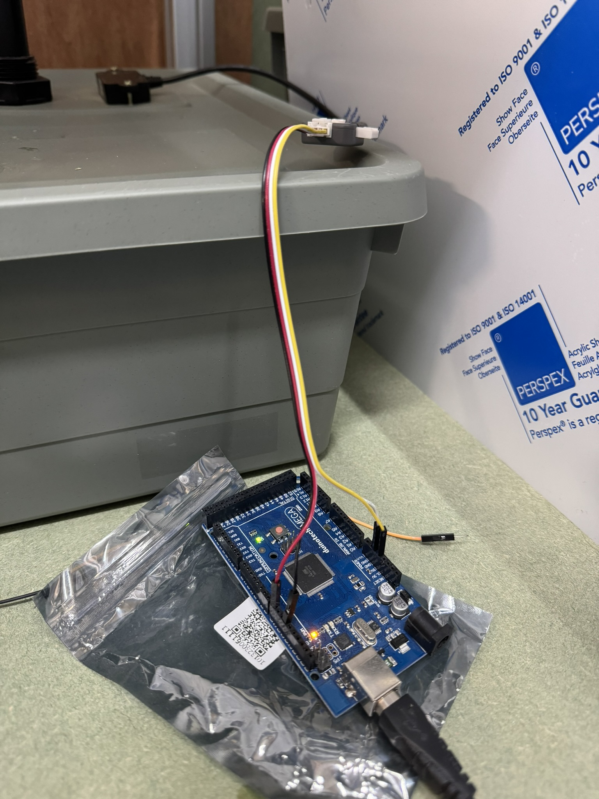

# basics-uart-sensor
A basics series repo. Connecting a A02YYUW ultrasound sensor to an Arduino using UART serial communication.

Waterproof ultrasounds distance sensor created by DFRobot. UART interface.

>[!caution]
>Most microcontrollers have limited numbers of UART interfaces and support limited software equivalents.

>[!warning]
>I have learnt the hard way that these sensors are not protected against incorrect wiring. I've ended up killing 2 sensors learning this. There is no external sign that they're toast but they just keep returning no sensible value on serial output.

>[!caution]
>It should be noted that every now and then the checksum failed. Only for a single frame and then it was fine, but this should therefore be taken into consideration in the context in which it is used.

This sensor can be powered off of the 5V output of an [[Arduino Mega 2560]] on USB with no additional power supply needed.

Test setup:

Serial output:

Both hardware and software UART interfaces have been tested and work as expected.

To use the `SoftwareSerial` interface, uncomment the commented out lines and comment out the use of `Serial1`.

# References

- [https://github.com/riteshRcH/waterproof_small_blind_ultrasonic_sensor_DYP-A02YYxx_v1.0](https://github.com/riteshRcH/waterproof_small_blind_ultrasonic_sensor_DYP-A02YYxx_v1.0)
- [https://wiki.dfrobot.com/_A02YYUW_Waterproof_Ultrasonic_Sensor_SKU_SEN0311#target_0](https://wiki.dfrobot.com/_A02YYUW_Waterproof_Ultrasonic_Sensor_SKU_SEN0311#target_0)
- On using multiple sensors: https://www.dfrobot.com/forum/topic/319904
